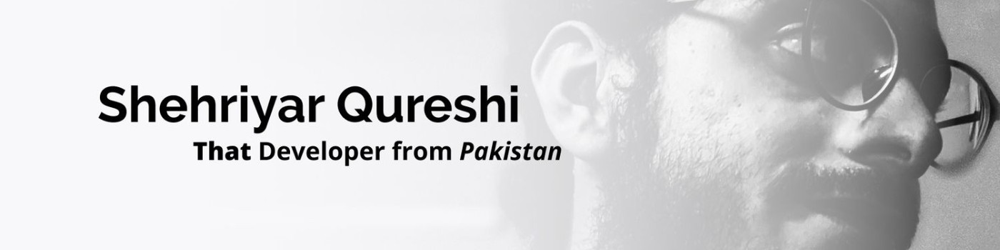

# Hi there 👋

I'm Shehriyar Qureshi, a **Self-Taught Software Engineer** from *Pakistan*.

## What I'm currently doing

- Using Rust to build networking tools
- Learning Angular by developing/maintaining my portfolio website
- Making Digital Content to document my journey

## How to reach me

My username is `thatdevsherry` on all socials (FB/Instagram/Twitter) etc
See my [website](https://shehriyarqureshi.com)

## Other things I like

- Good driving (rev match/heel-toe)
- Parkour
- Badminton

<!--
**ShehriyarQureshi/ShehriyarQureshi** is a ✨ _special_ ✨ repository because its `README.md` (this file) appears on your GitHub profile.

Here are some ideas to get you started:

- 🔭 I’m currently working on ...
- 🌱 I’m currently learning ...
- 👯 I’m looking to collaborate on ...
- 🤔 I’m looking for help with ...
- 💬 Ask me about ...
- 📫 How to reach me: ...
- 😄 Pronouns: ...
- ⚡ Fun fact: ...
-->
